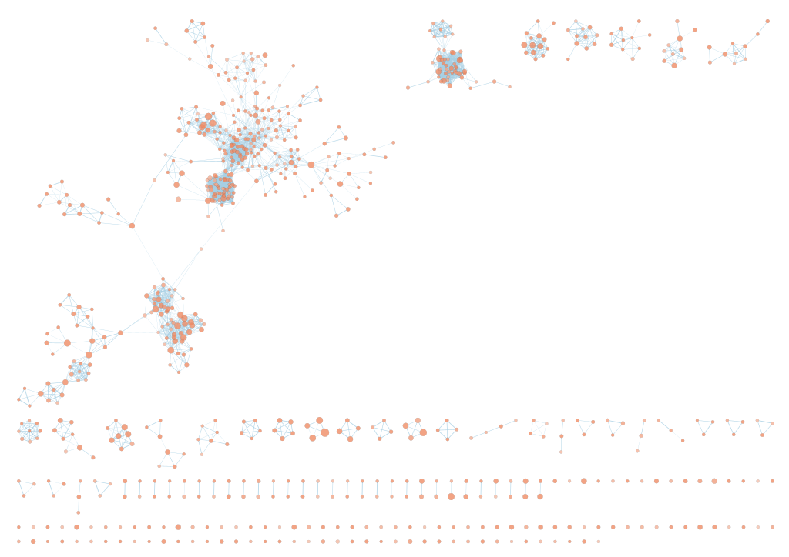
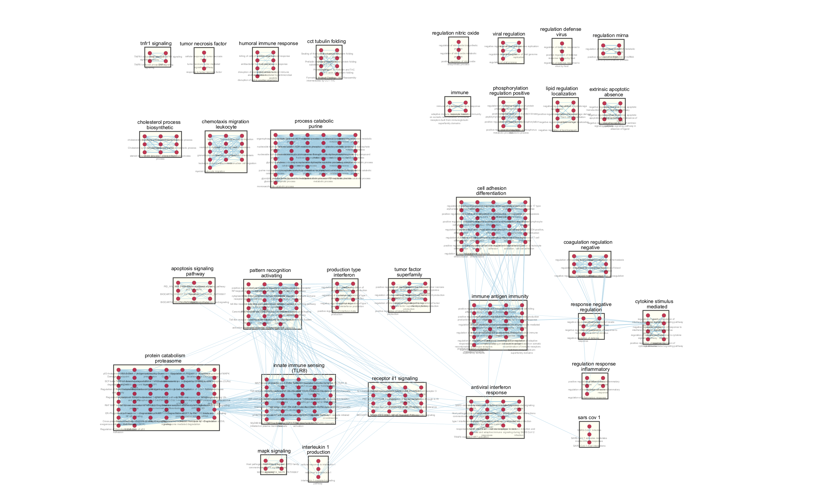
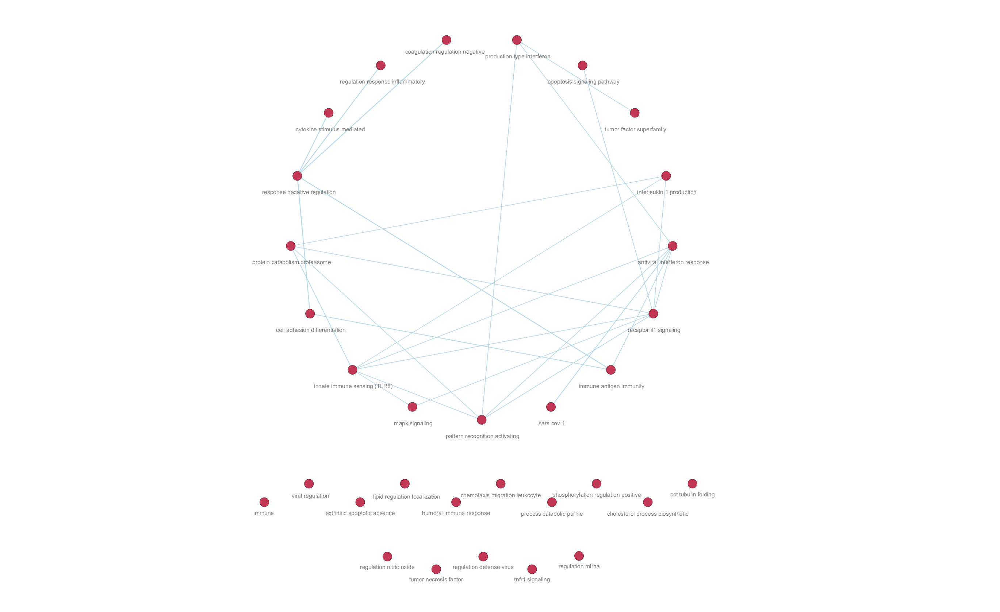

# Introduction

This report details the pathway and network analysis of the transcriptional response to SARS-CoV-2 infection in primary human lung cells. This analysis builds upon the processing and differential expression analysis performed in [Assignment 1](https://bcb420-2026.github.io/Wendy_Wan/A1_WendyWan.html), which focused on characterizing the early host inflammatory response.

## Data Source and Biological Context

The dataset used for this analysis was retrieved from the Gene Expression Omnibus (GEO) under accession GSE147507. The study focuses specifically on NHBE (Normal Human Bronchial Epithelial) cells, which serve as a primary cell model for the human airway. The experimental design compared two conditions:

1.  Test Condition: Three biological replicates of NHBE cells infected with SARS-CoV-2.
2.  Control Condition: Three biological replicates of Mock-infected NHBE cells.

## Preprocessing and Normalization

The raw human read count matrix originally contained 21,797 genes across 78 samples. To ensure a high-quality comparison, the dataset was filtered to include only the six NHBE replicates. Low-expression genes were removed using the `filterByExpr` function from the edgeR package, which retained genes with sufficient counts across at least three samples (the size of the smallest group). This filtering process resulted in a final dataset of 12,039 unique genes.

To account for technical biases such as sequencing depth and library composition, Trimmed Mean of M-values (TMM) normalization was applied. This method standardizes the data by picking a reference sample and calculating scaling factors that account for composition differences, ensuring that the expression levels are statistically comparable across all replicates.

## Differential Expression and Scoring

I conducted a differential expression analysis using a Negative Binomial model and the Quasi-Likelihood (QL) F-test within the edgeR framework. This approach provides robust control of false positives by accounting for the uncertainty in gene-specific dispersion estimates.

To identify significantly impacted genes, the following statistical thresholds were applied:

-   False Discovery Rate (FDR): \< 0.05 (Benjamini-Hochberg correction).
-   Fold-Change: \|log2FC\| \> 1 (representing a minimum two-fold change in expression).

The analysis identified 109 significant differentially expressed genes (DEGs). The majority of these genes (88) were up-regulated, reflecting a robust activation of inflammatory and antiviral pathways characteristic of the host's response to viral entry. These ranked gene results and their associated statistical scores provide the foundation for the pathway enrichment and network visualizations presented in this report.

# Over-Representation Analysis (ORA)

The following section details the ORA performed on the SARS-CoV-2 infected NHBE cells, utilizing the exported data from the previous analysis.

## Data Import and Query Set

I imported the directional gene lists to identify functional enrichment specific to up-regulated and down-regulated responses.

```{r, message=FALSE, warning=FALSE}
library(gprofiler2)
library(knitr)
library(kableExtra)
library(dplyr)

# load the significant hits exported from A1
sig_genes_df <- read.csv("A2_data/A1_significant_genes.csv", stringsAsFactors = FALSE)

# define query sets
upregulated_genes <- sig_genes_df %>% filter(logFC > 0) %>% pull(gene)
downregulated_genes <- sig_genes_df %>% filter(logFC < 0) %>% pull(gene)
all_de_genes <- sig_genes_df$gene

# print summary
cat("Upregulated genes:", length(upregulated_genes), "\n")
cat("Downregulated genes:", length(downregulated_genes), "\n")
```

## Methods and Parameters {#methods-and-parameters}

Following the CBW Workshop standards, I performed a thresholded ORA using `gprofiler2`[@Isserlin2024; @gprofiler2]. This R package was chosen for its programmatic accessibility and versioned archives, ensuring the analysis is reproducible.

The following parameters were chosen to perform the analysis:

-   Data Sources: I queried GO Biological Process, Reactome, and WikiPathways to capture a wide range of biological interactions.

-   Significance Threshold - `significant = TRUE`: A Benjamini-Hochberg FDR threshold of 0.05 was applied to control for false positives.

-   Evidence Filtering - `exclude_iea = TRUE`: We excluded Electronic Annotations (IEA) to rely solely on manually reviewed evidence.

-   Ordered Query - `ordered_query = FALSE`: Since our query consists of genes that already met a pre-defined significance threshold, I treat them as a single unranked set of "hits" for a standard hypergeometric test.

-   Size Filtering: Gene sets were restricted to a size between **3** and **250** genes to exclude uninformative broad terms and overly specific niche terms.

```{r, message=FALSE, warning=FALSE}
organism <- "hsapiens" # only return pathways in humans
sources <- c("GO:BP", "REAC", "WP")

# separate analysis allows identification of directional biological signals
up_ora <- gost(query = upregulated_genes, 
               organism = organism, 
               significant = TRUE, # show only significant results
               ordered_query = FALSE, # the query is not ordered
               exclude_iea = TRUE, # exclude GO electronic annotations
               correction_method = "fdr", # correct with FDR
               sources = sources)
```

### Separate Queries {#separate-queries}

Performing the analysis on up-regulated and down-regulated genes separately is a critical step in identifying the directional biological signatures. The combined set of 109 DEGs is heavily dominated by the **93 up-regulated** genes, which can mask the signals in the **16 down-regulated** genes.

## Results {#results}

### Top Enriched Pathways - Up-regulated Genes

The upregulated genes yielded **772 significant pathways**, with the most dominant signal being activation of the innate immune system, marked by **Interferon alpha/beta signaling** and **cytokine responses**. The top 10 significant gene sets are shown below in Table 6.

```{r, message=FALSE, warning=FALSE}
# apply filtering thresholds
up_filtered_results <- up_ora$result %>%
  filter(term_size >= 3, term_size <= 250) 

# display the total number of pathways after filtering
total_pathways <- nrow(up_filtered_results) 
cat("Total significant pathways:", total_pathways, "\n") 

# format top 10 results
up_top_10 <- up_filtered_results %>%
  select(source, term_id, term_name, term_size, p_value, intersection_size) %>%
  arrange(p_value) %>%
  slice_head(n = 10) %>%
  mutate(p_value = format(p_value, scientific = TRUE, digits = 4)) 

kable(up_top_10, format = "html", 
      caption = "Table 6: Top 10 Enriched Pathways for Upregulated Genes") %>%
  kable_styling(bootstrap_options = c("striped", "hover"), full_width = FALSE) 
```

### Observation of Downregulated Results

The down-regulated genes (n=21) were analyzed using the same parameters. In many viral infection models, this subset is significantly smaller and often yields fewer enriched pathways compared to the up-regulated "inflammatory burst."

```{r, message=FALSE, warning=FALSE}
down_ora<- gost(query = downregulated_genes, 
                         organism = organism, 
                         significant = TRUE, 
                         ordered_query = FALSE, 
                         exclude_iea = TRUE, 
                         user_threshold = 0.05, 
                         correction_method = "fdr", 
                         sources = sources)

# verification with threshold of 0.1
down_ora_low_thresh <- gost(query = downregulated_genes, 
                        organism = organism, 
                        significant = TRUE, 
                        ordered_query = FALSE, 
                        exclude_iea = TRUE, 
                        user_threshold = 0.1, 
                        correction_method = "fdr", 
                        sources = sources)

# print message
cat("Number of significant pathways at FDR < 0.05:", 
    ifelse(is.null(down_ora), 0, nrow(down_ora$result)), "\n")

cat("Number of significant pathways at FDR < 0.1:", 
    ifelse(is.null(down_ora_low_thresh), 0, nrow(down_ora_low_thresh$result)), "\n")
```

The ORA for the 21 down-regulated genes returned **zero significant pathways** at the standard $FDR < 0.05$ threshold. To verify if this was due to a technical error or a lack of statistical power, the analysis was re-run with a relaxed threshold of $FDR < 0.1$, which successfully yielded a list of enriched pathways. This verification confirms that the lack of results at the primary threshold is a statistical consequence of the small query size ($n=21$) rather than a software error. Biologically, this suggests that the host response in NHBE cells at this early time point is characterized by a highly coordinated **activation** of immune pathways—consistent with the "inflammatory burst" described by Blanco-Melo et al. (2020)—rather than a coordinated **suppression** of biological functions.

## Interpretation and Discussion

### Alignment with the Original Paper {#alignment-with-the-original-paper}

The over-representation results strongly support the central mechanism proposed by Blanco-Melo et al. (2020) that an imbalanced host response to SARS-CoV-2 drives development of COVID-19[@BlancoMelo2020]. Our top results include "Overview of proinflammatory and profibrotic mediators" and "Interleukin-10 signalling". This aligns with the study’s finding that SARS-CoV-2 infection induces high levels of cytokines (e.g., IL-6, TNF, and IL-1RA), which drive the inflammatory pathology of COVID-19[@BlancoMelo2020]. Additionally, the discovery of **772 significant pathways** for upregulated genes versus 0 for downregulated genes (at $FDR < 0.05$) reinforces the paper’s narrative that the acute phase of infection is characterised by a massive, coordinated induction of host genes involved in inflammatory recruitment.

### Good title to show a little bit of a misalignment with original paper

While we see enrichment in "Interferon alpha/beta signaling," Blanco-Melo et al. noted that this response is uniquely "low" relative to the high viral load when compared to other respiratory viruses like Influenza A[@BlancoMelo2020]. Our ORA identifies these pathways as significant within the NHBE context, which confirms the virus does trigger these signatures, but the original paper clarifies that this response is insufficient to halt viral replication.

### Supporting Evidence from Literature {#supporting-evidence-from-literature}

**NF-$\kappa$B Signaling and Viral Persistence**

The identification of "Photodynamic therapy induced NF kB survival signaling" ($P = 4.460 \times 10^{-12}$) as a significant pathway aligns with broader research into SARS-CoV-2 pathogenesis. Research indicates that SARS-CoV-2 proteins, specifically Nsp5, can activate the NF-$\kappa$B pathway by upregulating the SUMOylation of MAVS[@Wang2022], thereby promoting a pro-inflammatory environment. Chronic NF-$\kappa$B activation is a known driver of the severe lung inflammation seen in COVID-19 patients, as it coordinates the expression of multiple cytokines and chemokines that lead to tissue damage[@Li2021].

**Bacterial/LPS-like Responses and TLR Activation**

The presence of terms like "response to lipopolysaccharide" ($P = 2.359 \times 10^{-16}$) and "response to molecule of bacterial origin" ($P = 9.877 \times 10^{-16}$) suggests a significant overlap in innate sensing mechanisms. SARS-CoV-2 components, such as the Spike (S) protein, can be recognized by Toll-Like Receptors (TLR), such as TLR2 and TLR4[@Khanmohammadi2021], which are traditionally associated with bacterial sensing (e.g., LPS). The activation of these TLRs triggers a downstream signaling cascade involving MyD88[@Zhu2023], which converges on the same inflammatory pathways—such as NF-$\kappa$B—that are activated by bacterial lipopolysaccharides.

# Non-thresholded Gene set Enrichment Analysis

## Methods and Parameters {#methods-and-parameters2}

Following the CBW Pathways Workshop protocol, a non-thresholded analysis was performed using GSEA Preranked version 4.4.0[@Subramanian2005]. This approach evaluates the coordinated movement of genes across the entire ranked transcriptome of **12,039 genes**, allowing for the detection of biological signals that may be missed by the arbitrary cutoffs required for thresholded ORA.

### Gene Set Database

I used the **BaderLab Gene Sets** (September 01, 2025 version: `Human_GOBP_AllPathways_noPFOCR_no_GO_iea_September_01_2025_symbol.gmt`[@BaderLab2025]) as the gene set database. It integrates Gene Ontology (<GO:BP>), Reactome, and WikiPathways, excluding electronic annotations (IEA) to ensure results are based on manually reviewed evidence.

### Rank Metric

The genes are ranked by a composite score calculated as: $$RankScore = -log_{10}(PValue) \times \text{sign}(logFC)$$ Therefore, genes with the highest significance and largest effect sizes are at the extremes of the list.

### Parameters

The following parameter values were chosen:

-   Permutations: **2,000 permutations** to establish the null distribution.

-   Scoring Scheme: **Weighted**, to emphasize the top-ranked genes.

-   Size Limits: **Minimum of 15** and **maximum of 200** genes per set to ensure biological interpretability.

## GSEA Execution in R

### 1. Retrieve Latest Pathway Definitions

Firstly, I downloaded the latest GMT file from the BaderLab server.

```{r, message=FALSE, warning=FALSE}
library(RCurl)

data_dir <- "A2_data"

# define path for the september 1st, 2025 GMT file
gmt_url <- "https://download.baderlab.org/EM_Genesets/September_01_2025/Human/symbol/"
gmt_file_name <- "Human_GOBP_AllPathways_noPFOCR_no_GO_iea_September_01_2025_symbol.gmt"
dest_gmt_file <- file.path(data_dir, gmt_file_name)

# download the GMT file
if(!file.exists(dest_gmt_file)){
    download.file(paste0(gmt_url, gmt_file_name), destfile = dest_gmt_file)
}
```

### 2. Generate Rank File

Then, I prepared the `.rnk` file required for the GSEA tool.

```{r, message=FALSE, warning=FALSE}
# load csv from assignment 1
results_all <- read.csv("A2_data/A1_full_results.csv", stringsAsFactors = FALSE)

# create ranked genes dataframe
ranked_genes <- results_all %>%
  mutate(rank = -log10(PValue) * sign(logFC)) %>%
  select(gene, rank) %>%
  arrange(desc(rank))

# save .rnk file
rnk_file_path <- file.path(data_dir, "NHBE_SARSCoV2_ranks.rnk")

write.table(ranked_genes, rnk_file_path, 
            sep = "\t", row.names = FALSE, col.names = FALSE, quote = FALSE)
```

### 3. Run GSEA Command

Using the `system()` command, I ran the GSEA analysis.

```{r, message=FALSE, warning=FALSE, include = FALSE}
gsea_output_path <- file.path(data_dir, "GSEA_results")

command <- paste("", params$gsea_jar,  
                 "GSEAPreRanked -gmx", dest_gmt_file, 
                 "-rnk", params$rnk_file, 
                 "-collapse false -nperm 2000 -scoring_scheme weighted", 
                 "-rpt_label", params$analysis_name,
                 "-plot_top_x 20 -rnd_seed 12345 -set_max 200",  
                 "-set_min 15 -zip_report false",
                 "-out", gsea_output_path, 
                 ">", file.path(data_dir, "gsea_output.txt"), sep=" ")
system(command)
```

## Enrichment Results Summary {#enrichment-results-summary}

The GSEA identified a significant number of pathways enriched in the SARS-CoV-2 infected phenotype compared to the mock-infected control.

### Upregulated Pathways

Out of 5,213 gene sets, **3,682** were upregulated in the infected phenotype. Of these, **1,603** were significant at a False Discovery Rate (FDR) \< 25%, and **806** were highly significant at a nominal p-value \< 1%. The top enriched pathways included \* **TNF-**$\alpha$ Signaling via NF-$\kappa$B (NES: 2.94) and **Interferon Gamma Response** (NES: 2.80).

### Downregulated Pathways

In the negative direction only **1,531** gene sets were downregulated in infection. Of these, only **14** gene sets reached an FDR \< 25%. Notable pathways included **Fibroblast Growth Factor Receptor Signaling Pathway** (NES: -1.91) and **Negative Regulation of Mitotic Nuclear Division** (NES: -1.88).

Detailed enrichment results, including individual mountain plots and leading-edge analysis for all 5,213 pathways, can be viewed directly in the generated [GSEA Index Report](./GSEA_results/NHBE_SARSCoV2_GSEA.GseaPreranked.1772940304919/index.html). MAKE SURE THIS LINK WORKS

## Thresholded vs. Non-thresholded Analysis {#thresholded-vs-non-thresholded-analysis2}

Qualitatively, the comparison between the thresholded ORA and the non-thresholded GSEA reveals both consistency and increased sensitivity in the GSEA approach. Both methods strongly identified the activation of the innate immune response, particularly Interferon Alpha/Beta signaling and NF-$\kappa$B signaling. These results align with the primary host response mechanisms described by Blanco-Melo et al. (2020), where a robust pro-inflammatory environment is established despite the virus's evasion tactics.

The biggest difference between the two methods is found in the downregulated genes. The thresholded ORA for the 21 downregulated genes returned zero significant pathways at $FDR < 0.05$. However, the non-thresholded GSEA recovered 14 significant pathways ($FDR < 25\%$). This suggests that the signal for host suppression—specifically related to mitotic division and structural growth factor signaling—is subtle and requires the cumulative statistical power of the entire ranked list to be detected.

### Is this a straightforward comparison? {#is-this-a-straight-forward-comparison}

**No, this is not a straightforward comparison**. The two methods rely on fundamentally different statistical foundations. ORA uses a **hypergeometric test** that treats a gene list as a discrete set of hits against a background, making it highly dependent on the choice of p-value and log-fold change thresholds. GSEA, uses a **Kolmogorov-Smirnov-like statistic** that is threshold-free and considers the relative position of every gene in the genome. While GSEA found over double the number of upregulated pathways (1,603) compared to ORA (772), this increase reflects GSEA's ability to include bigger pool of genes that contribute to the biological theme of a pathway even if they individually failed to pass the $FDR < 0.05$ cutoff in Assignment 1.

# Visualizing Gene Set Enrichment Analysis in Cytoscape

To create an enrichment map using our GSEA results, I used Cytoscape, a web tool for generating network plots which groups pathways based on shared gene members[@Shannon2003].

## Creating the Enrichment Map

The enrichment map was created using the EnrichmentMap Pipeline Collection plugin[@Reimand2019]. Nodes represent individual gene sets, while edges represent shared genes (similarity).

### Thresholds and Parameters {#thresholds-and-parameters}

-   FDR Q-value Cutoff: 0.1.

-   P-value Cutoff: 1.0.

-   Edge Strategy: Jaccard + Overlap Combined (Cutoff: 0.375).

The resulting map consists of **745** nodes and **3908** edges. This large network was altered heavily to highlight the most imformative pathways, detailed in the [annotating and clustering](#annotating-and-clustering) section.

### Note on Directionality

The final network is composed entirely of upregulated pathways represented by red nodes. While the non-thresholded GSEA identified 1,531 gene sets in the negative (Mock) phenotype, none passed the FDR \< 0.05 threshold for inclusion in the network.

```{r, message=FALSE, warning=FALSE}

```

**Figure 1: Rough Enrichment Map of NHBE Host Response to SARS-CoV-2.** The network represents **745** nodes and **3908** edges before the use of AutoAnnotate and manual refinement for a publication-ready figure.

## Annotating and Clustering {#annotating-and-clustering}

To resolve the network's structure into biological themes, we utilized the AutoAnnotate app[@Reimand2019].

-   Clustering Algorithm: MCL (Markov Clustering).

-   Label Creation: WordCloud (Max words per label: 3; Min word frequency: 3).

-   Layout: "Layout network to minimize cluster overlap" was used for initial separation.

To create a publication-ready figure, the **similarity** slider was increased to **0.60** to remove weak edges and allow for more visibility in the network. Uninformative singletons and generic clusters (e.g., "signaling pathway," "regulation") were removed, to highlight the most significant and largest pathway clusters.

## Enrichment Map and Theme Network

```{r, message=FALSE, warning=FALSE}

```

**Figure 5: Annotated Enrichment Map of NHBE Host Response to SARS-CoV-2.** Nodes represent biological pathways. Node color is mapped to the Normalized Enrichment Score (NES) where red indicates activated pathways and blue indicates repressed pathways. However, the above analysis did not have any repressed clusters. Edges represent shared genes between pathways (cutoff = 0.60). Clusters are boxed in with refined high-level biological themes .

The network was collapsed into a summary theme network to identify the major biological categories driving the host response.

```{r, message=FALSE, warning=FALSE}

```

**Figure 6: Collapsed Theme Network of SARS-CoV-2 Host Response.** Each node represents a summary theme (collapsed cluster) derived from the enrichment map in Figure 5. This view highlights the dominance of themes such as protein catabolism, antiviral defense, and innate sensing themes as the primary drivers of the transcriptomic shift during infection.

## Results and Interpretation

### Major Themes {#major-themes}

The major themes identified in the network analysis include, but are not limited to: 1. **Antiviral interferon response:** Represented by clusters involving Type I/II Interferon signaling and response to virus. 2. **Innate immune sensing and inflammation:** Dominated by TLR8 signaling, TNF-$\alpha$ signaling via NF-$\kappa$B, and cytokine stimulus. 3. **Protein catabolism and the proteasome:** A large, highly interconnected hub focusing on protein degradation and mRNA processing. 4. **Humoral response:** Clusters related to the antimicrobial humoral response.

### Model Alignment

Yes. These themes align with the imbalanced host response model described by Blanco-Melo et al. (2020)[@BlancoMelo2020]. The map showcases a massive inflammatory and antiviral signature that defines the cytokine storm pathology. The lack of any downregulated (blue) clusters at the $FDR < 0.05$ threshold further emphasizes the unidirectional nature of this response in NHBE cells, where immune and catabolism activation is far more prevalent than the suppression of any pathways.

### Novel Pathways/Themes {#novel-pathways}

The **protein catabolism & proteasome** and **purine catabolic process** clusters represent novel insights that were not as prominent in the thresholded ORA. While the ORA identified key processes, the GSEA was able to gauge a broader view of the transcriptional landscape and identify metabolic changes due to infection. The significant activation of the proteasome and nucleotide metabolism suggests the extensiveness of viral replication and protein processing by the cell's internal machinery. This additional detail that adds more context to the original paper’s focus on the inflammatory findings.

### Supporting Evidence from Literature {#supporting-evidence-from-lit}

The activation of the **humoral immune response** and other immune related clusters identified in our network is supported by clinical observations showing that SARS-CoV-2 triggers the complement cascade, which contributes to lung injury and systemic hyper-inflammation [@Zhu2023]. Additionally, the large enrichment in **protein catabolism** reflects the heavy reliance of the virus on host translational machinery for replication, a sign of Coronaviridae infections [@Wang2022].

# Question Key

The following section contains a guide to the discussion questions for A2. Clicking on the question links back to the section where the analysis was performed, and a brief answer is provided for easy access.

## Thresholded Over-representation Analysis Questions

[**Which method did you choose and why?**](#methods-and-parameters)

g:Profiler (`gprofiler2`) was chosen for programmatic access to updated functional annotations and reproducibility within R.

[**What annotation data did you use and why?**](#methods-and-parameters)

<GO:BP>, Reactome, and WikiPathways were used to capture a comprehensive range of biological systems, excluding IEA for high-confidence results.

[**What version of the annotation are you using?**](#version-information)

`g:Profiler` version e113_eg59_p19_6be52918

[**How many genesets were returned with what thresholds?**](#results)

772 significant pathways were identified for the upregulated genes ($n=88$), while 0 pathways met the $FDR < 0.05$ threshold for the downregulated genes ($n=21$).

[**Separate vs. combined analysis of up-regulated set and down-regulated set of genes**](#separate-queries)

Separate queries were required to prevent the dominant upregulated inflammatory signals from masking the presence of the smaller downregulated set.

[**Do the over-representation results support conclusions or mechanism discussed in the original paper?**](#alignment-with-the-original-paper)

The ORA results strongly align with the imbalanced immune response and massive cytokine induction described by Blanco-Melo et al. (2020)[@BlancoMelo2020].

[**Can you find evidence, i.e. publications, to support some of the results that you see. How does this evidence support your results.**](#supporting-evidence-from-literature)

Independent studies confirm that SARS-CoV-2 proteins trigger the NF-$\kappa$B and TLR4 pathways identified in my analysis[@Khanmohammadi2021; @Wang2022].

## Non-thresholded Gene set Enrichment Analysis

[**What method did you use?**](#methods-and-parameters2)

GSEA Preranked version 4.4.0 CLI.

[**What gene sets did you use?**](#methods-and-parameters2)

BaderLab Human GOBP/AllPathways (September 01, 2025).

[**Summarize your enrichment results**](#enrichment-results-summary)

1,603 upregulated and 14 downregulated gene sets were significant at $FDR < 25\%$.

[**How do these results compare to the results from the thresholded analysis?**](#thresholded-vs-non-thresholded-analysis2)

The non-thresholded GSEA provided higher sensitivity, particularly in recovering the subtle downregulated signal that ORA missed.

[**Is this a straight forward comparison? Why or Why not?**](#is-this-a-straight-forward-comparison)

No, it is not a straight forward comparison.

## Visualizing in Cytoscape

[**How many nodes and edges are in the map?**](#thresholds-and-parameters)

The initial map contained 745 nodes and 3908, which were then adjusted for visual clarity.

[**What parameters were used for annotation?**](#annotating-and-clustering)

MCL clustering with WordCloud labeling was used with a 3-word limit.

[**What are the major themes present in this analysis? Do they fit with the model?**](#major-themes)

Major themes include Interferon signaling, TLR8 sensing, and Protein Catabolism. These support the imbalanced response model of Blanco-Melo et al. (2020).

[**Are there any novel pathways or themes?**](#novel-pathways)

Metabolic clusters like catabolism & proteasome and purine catabolic provided novel depth compared to the ORA results.

[**Do the enrichment results support conclusions or mechanism discussed in the original paper?**](#alignment-with-the-original-paper)

Yes, the TNF and Interferon signatures align with the imbalanced response model [@BlancoMelo2020].

[**Can you find evidence, i.e. publications, to support some of the results that you see. How does this evidence support your results.**](#supporting-evidence-from-lit)

Activation of TLR8 and the Proteasome are supported by recent studies on viral sensing and replication [@Khanmohammadi2021; @Wang2022].

